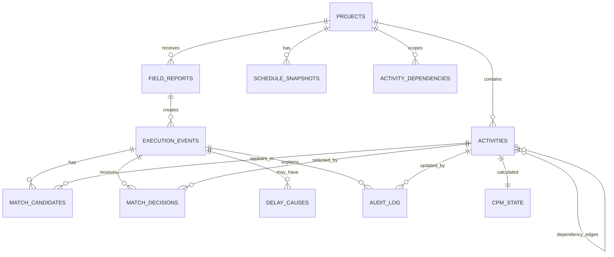

# ProgressSync AI: Final Prototype Technical Handover

**Project:** ProgressSync AI - SIH26122  
**Audited revision:** `12b4376` (`feat: integrate ML reranker and harden MVP workflow`)  
**Audit date:** 2026-09-22  
**Authority:** Current source code, checked-in data/artifacts, and commands run during this audit. The code is authoritative when it disagrees with older documentation.

## 1. Executive Scope

ProgressSync AI is an offline-oriented FastAPI prototype that converts a short field observation into a structured execution event, ranks possible schedule activities, routes the event to automatic matching, planner review, or unmatched handling, and on confirmation updates activity actuals, writes an audit record, and recomputes a dependency-network CPM state.

The working backend is in [backend/app.py](backend/app.py). The default browser UI is the static application in [frontend/index.html](frontend/index.html), served by FastAPI. A separate React/Vite application is in [frontend-react](frontend-react); it consumes the same API but is not served by the FastAPI root route.

This is a prototype, not a production scheduling product. It has no authentication, authorization, external Primavera integration, production OCR/ASR pipeline, durable conversational session state, or migration/deployment system.

## 2. SIH Problem in Plain Language

### 2.1 The real project setting

An infrastructure or plant project is planned as a schedule of work packages. Each schedule activity has an identifier, description, WBS location, discipline, planned dates, duration, and often a contractor or resource. Work is executed in the field by crews. Supervisors report what they saw in natural language, for example:

> Piping crew completed spool XX102 at rack 3, 100%.

The planner must decide which schedule activity this observation refers to, update progress and actual dates, and understand whether the dependency network or critical path changed.

### 2.2 L1-L6 terminology in this repository

The repository uses `level` values in seeded/imported activities, especially level 5 and level 6. The code does not implement a separate class or workflow for each L1-L6 level. In the prototype, the levels are schedule metadata:

- **L1-L4:** higher-level project/WBS groupings conceptually represented by `wbs_path`; they are not separately modeled as rows by the seed routine.
- **L5:** a work-package/activity level used by the synthetic seeded schedule.
- **L6:** the detailed execution activity level used by the supplied sample schedule and benchmark data.

Do not infer a full hierarchical WBS implementation from the names. There is no `parent_id` column or WBS entity/table in the current schema.

### 2.3 Field progress report

A field report is raw text submitted with a source label such as `text`, `diary`, or `time_agent`. `extract_event()` uses deterministic regular expressions and normalization to find discipline, identifiers, rack-style location, percentage, quantity/unit, time text, and source span. It does not call an LLM.

### 2.4 Why linking is difficult

Field language and schedule language differ. A supervisor may say `spool`, `install`, `rack 3`, or `CT103`; the schedule may say `piping segment`, `erect`, `R03`, or `CT-103`. IDs may be omitted, abbreviated, misspelled, or shared by multiple candidates. The matcher therefore records component scores, terminology evidence, contextual signals, the top candidate, runner-up, and margin instead of treating one string comparison as truth.

### 2.5 What this prototype solves

It demonstrates the following implemented path:

1. Accept raw text or a CSV/XLSX schedule.
2. Extract one structured progress event from report text.
3. Score schedule activities using identifier, lexical, local MiniLM semantic, discipline/location context, and date compatibility signals.
4. Optionally rerank the top 20 candidates with a checked-in logistic-regression artifact.
5. Produce `AUTO_MATCHED`, `REVIEW_REQUIRED`, or `UNMATCHED`.
6. Let a planner confirm or reject a candidate.
7. On confirmation, update percent complete/status/actual dates, write before/after audit JSON, recompute CPM, and return critical-path impact.
8. Expose schedule, analytics, audit, terminology, and similar-history data to the UIs.

### 2.6 Expected users versus implemented access

The UI language targets supervisors, planners, and project controls staff. The current API has no authentication or role enforcement; `actor` is a caller-supplied string. These are expected user roles, not implemented security controls.

## 3. End-to-End Example

### Schedule row

```text
activity_code: PIP-L6-047
activity_code description: Erect line XX102 spool
wbs_path: WBS/PIPING/R03
level: 6
 discipline: piping
location: R03
planned_start: 2026-09-10
planned_finish: 2026-09-14
```

### Field report

```text
Piping crew completed spool XX102 at rack 3, 100%.
```

### Actual prototype behavior

`POST /api/v1/reports` stores the raw report in `field_reports`. `extract_event()` detects `piping`, identifier `XX102`, location `R03`, progress `100`, event date `date.today()`, the complete input as source span `[0, len(text)]`, and extraction confidence `0.86`. `make_match()` loads project 1 activities and all terminology rows, maps `spool` to `piping segment` and `rack 3` to `R03`, calculates all component scores, and stores up to 20 candidates with JSON evidence.

With the reranker disabled, the decision is `AUTO_MATCHED` only when the fused top score is at least `0.82` and the fused margin over the runner-up is at least `0.12`. Otherwise it is review when the top fused score is at least `0.45`, and unmatched below that. If a planner confirms the activity, `apply_update()` sets progress to 100, status to `complete`, sets actual start if needed, sets actual finish to the event date, stores old/new JSON in `audit_log`, and creates before/after schedule snapshots and CPM state.

The prototype does not prove that every real `XX102` is unique. It also does not parse the human time `4:45 PM` into the event date/time used for the update; the extractor only captures time text and uses today's date for `event_timestamp`.

## 4. Actual Architecture

```mermaid
flowchart LR
  A[Text / diary / Time Agent / CSV-XLSX schedule] --> B[FastAPI endpoint]
  B --> C[SQLite field_reports or activities]
  C --> D[extract_event: normalize + regex]
  D --> E[Candidate scoring]
  E --> F[MiniLM semantic similarity]
  F --> G[Optional logistic reranker]
  G --> H{Decision thresholds}
  H -->|AUTO_MATCHED| I[Stored decision]
  H -->|REVIEW_REQUIRED| J[Review queue]
  H -->|UNMATCHED| J
  J --> K[Planner confirm or reject]
  I --> L[Schedule actual update]
  K --> L
  L --> M[Audit old/new values]
  L --> N[NetworkX CPM + snapshots]
  N --> O[Schedule / analytics / history APIs]
  M --> O
  O --> P[Static UI or React/Vite UI]
```



| Stage | Input and output | Responsible code | Failure/current behavior | Stored data |
|---|---|---|---|---|
| Schedule import | CSV/XLSX bytes -> validated activity rows | `import_schedule()` in [backend/app.py](backend/app.py) | Rejects non-CSV/XLSX, >10 MB, invalid dates, invalid discipline, missing required columns; row errors are returned and valid rows remain inserted | `activities`; recompute snapshot |
| Report ingestion | JSON `{project_id,text,source}` -> report/event/match response | `report()`, `ReportIn` | Validation errors are FastAPI 422; model/import/runtime errors can surface as server errors | `field_reports`, `execution_events`, `match_candidates`, `match_decisions` |
| Preprocessing | Raw text -> ASCII-lower normalized tokens | `norm()`, `tokens()` | Empty input rejected by Pydantic; OCR is not a separate service | Not separately stored; raw text remains in report/event |
| Event extraction | Text -> one event dict | `extract_event()` | Unknown fields become `None`; exactly one generic `progress_update` event is produced | `execution_events` columns including JSON identifiers/source span |
| Candidate retrieval | Event + project-1 activity catalogue -> candidate list | `make_match()` | High-confidence discipline mismatch is filtered; if none remain, a fallback path is attempted but is not a normal valid-activity path | Candidate rows for up to 20 activities |
| Component scoring | Event/activity -> score components | `score_candidate()` | Local MiniLM is mandatory in the current code path; missing local model raises rather than falling back to the README's claimed proxy | Component scores and evidence JSON |
| Semantic matching | Normalized mapped field terms and activity description -> cosine-like dot product | `get_semantic_model()`, `semantic_similarity()` | `SentenceTransformer("all-MiniLM-L6-v2", local_files_only=True)` must load from local assets/cache | Not separately stored; score is persisted |
| Reranking | Top 20 baseline candidates -> probabilities/order | `get_reranker()`, reranker branch in `make_match()` | Opt-in through `PROGRESSSYNC_USE_RERANKER`; absent artifact means no reranking; enabled artifact load errors are not broadly handled in matching | Reranker probability/version in evidence JSON |
| Decision | Scores + margin + explicit unknown signal -> status | `make_match()` | Unknown language such as `ZZ-999` forces `UNMATCHED` | `match_decisions`, event/report status |
| Human review | Review queue -> selected activity/rejection | `confirm()`, `reject()`, `apply_update()` | Confirm rejects already approved events with 409; unmatched requires an activity ID | Decision actor/comment; audit on confirm |
| Schedule update | Event progress -> activity actuals/status | `apply_update()` | Does not validate that activity belongs to the requested project; confirmation currently passes project 1 | Activity fields and audit old/new JSON |
| CPM | Activity durations/dependency DAG -> ES/EF/LS/LF/float/critical | `cpm_state()`, `recompute()` | Cyclic graph raises `ValueError`; uses planned duration and dependency lag, not resource leveling | `cpm_state`, `schedule_snapshots` |
| Analytics/history | SQLite rows -> aggregate JSON | analytics routes and `memory()` | Delay causes have no write route; memory labels planned duration as actual duration | Read-only response data |
| Frontend | API JSON -> static or React views | [frontend/app.js](frontend/app.js), [frontend-react/src](frontend-react/src) | React requires a separately started Vite dev server; backend root serves static UI | Browser state only |

## 5. Repository Map

| Path | Purpose | Edit guidance |
|---|---|---|
| [backend/app.py](backend/app.py) | FastAPI app, raw SQL schema, seed data, extraction, matching, CPM, all routes | Primary implementation file; change carefully and add tests |
| [backend/__init__.py](backend/__init__.py) | Empty package marker | Do not add duplicate services here |
| [frontend/index.html](frontend/index.html), [frontend/app.js](frontend/app.js), [frontend/styles.css](frontend/styles.css) | Static UI served by FastAPI | Current default UI; preserve API contracts |
| [frontend-react/src](frontend-react/src) | Separate React UI, API wrapper, views, components, styles | Preferred UI integration surface if React becomes the main frontend |
| [frontend-react/package.json](frontend-react/package.json) | Vite/React scripts and dependencies | Run npm from this directory |
| [data](data) | Small sample schedule, sample reports, terminology YAML | Samples are not automatically loaded by startup; verify before treating as fixtures |
| [benchmark/generated](benchmark/generated) | Generated 280-row benchmark schedule, 60 reports split into train/held-out, reranker datasets | Regenerated by scripts; do not manually tune held-out data |
| [ml_artifacts](ml_artifacts) | Pickled reranker and metrics JSON | Binary artifact should be rebuilt by the documented training sequence |
| [scripts](scripts) | Corpus generation, reranker dataset/build/train/evaluate/benchmark/demo scripts | Script assumptions must be checked against runtime model availability |
| [tests/test_pipeline.py](tests/test_pipeline.py) | Five backend integration-style tests | Add behavior tests here or split by service as scope grows |
| [docs](docs) | Short design/API/demo/testing notes | Several statements are stale versus code; do not use them as implementation authority |
| [requirements.txt](requirements.txt) | Python dependencies | Install before running backend/tests |
| [.env.example](.env.example) | Declares `DEMO_MODE` and `PROGRESSSYNC_DB` | It omits implemented `PROGRESSSYNC_USE_RERANKER` |
| [ProgressSync_AI_Master_Development_Document_SIH26122.pdf](ProgressSync_AI_Master_Development_Document_SIH26122.pdf) | Design/development PDF | Historical context only; current code wins |

## 6. Runtime and Configuration

### Backend

```powershell
python -m venv .venv
.\.venv\Scripts\Activate.ps1
pip install -r requirements.txt
$env:PROGRESSSYNC_DB="data/progresssync.db"
uvicorn backend.app:app --reload
```

Open `http://127.0.0.1:8000`. FastAPI serves the static UI at `/`.

### React

```powershell
cd frontend-react
npm install
npm run dev
```

Vite uses `127.0.0.1:5173` and proxies `/api` to `http://127.0.0.1:8000`. The React app does not have URL routes; `App.jsx` switches five views in component state.

### Environment variables

| Variable | Current use | Default |
|---|---|---|
| `PROGRESSSYNC_DB` | SQLite file path read at module import | `data/progresssync.db` |
| `PROGRESSSYNC_USE_RERANKER` | Enables checked-in reranker when truthy (`1,true,yes,on`) | false |
| `DEMO_MODE` | Documented and displayed conceptually by React's default prop, but not read by backend and not passed from App | No backend effect |

Database initialization occurs in the FastAPI startup event. Use `with TestClient(app)` in tests so startup executes. A direct client without lifespan context can produce `sqlite3.OperationalError: no such table: activities` on a fresh database.

## 7. Database: Current Schema

SQLite schema is the `SCHEMA` string in [backend/app.py](backend/app.py). `connect()` enables `PRAGMA foreign_keys = ON`, but the `CREATE TABLE` definitions do not declare foreign-key constraints.



| Table | Primary key and fields | Relationships/indexes/constraints |
|---|---|---|
| `projects` | `id`; `name NOT NULL`; `created_at NOT NULL` | No declared FK/index beyond PK |
| `activities` | `id`; `project_id NOT NULL`; `activity_code NOT NULL`; `description NOT NULL`; `wbs_path`; `level NOT NULL`; `discipline NOT NULL`; `location`; `planned_start`; `planned_finish`; `planned_duration`; `actual_start`; `actual_finish`; `percent_complete DEFAULT 0`; `status DEFAULT 'not_started'`; `contractor`; `resource`; `embedding DEFAULT '[]'`; `at_risk DEFAULT 0` | `UNIQUE(project_id, activity_code)`; no declared FK to project; no explicit indexes |
| `activity_dependencies` | `id`; `project_id NOT NULL`; `predecessor_id NOT NULL`; `successor_id NOT NULL`; `dependency_type DEFAULT 'FS'`; `lag DEFAULT 0` | No FK or uniqueness constraint on edge |
| `cpm_state` | `activity_id` PK; `early_start`; `early_finish`; `late_start`; `late_finish`; `total_float`; `critical`; `project_finish`; `updated_at` | One row per activity by convention; no FK |
| `schedule_snapshots` | `id`; `project_id NOT NULL`; `reason`; `created_at NOT NULL`; `project_finish`; `state_json NOT NULL` | Full serialized CPM map; no FK |
| `field_reports` | `id`; `project_id NOT NULL`; `source NOT NULL`; `raw_text NOT NULL`; `submitted_at NOT NULL`; `latency_ms`; `status DEFAULT 'received'` | No FK to project |
| `execution_events` | `id`; `report_id NOT NULL`; `event_type`; `discipline`; `activity_terms`; `identifiers`; `location_terms`; `quantity`; `unit`; `progress`; `event_timestamp`; `source_text`; `source_span`; `extraction_confidence`; `status DEFAULT 'PENDING'` | JSON is stored as text; no FK to report |
| `match_candidates` | `id`; `event_id NOT NULL`; `activity_id NOT NULL`; `score_id`; `score_lexical`; `score_semantic`; `score_context`; `temporal_factor`; `fused_score`; `rank`; `evidence_json` | No uniqueness constraint for repeated matching |
| `match_decisions` | `id`; `event_id NOT NULL`; `decision NOT NULL`; `activity_id`; `top_score`; `second_score`; `margin`; `actor`; `comment`; `created_at NOT NULL` | Multiple decisions can exist per event; latest is selected by descending id |
| `terminology_map` | `id`; `field_term`; `canonical_term`; `discipline`; `version`; `source` | No uniqueness/version constraint |
| `delay_causes` | `id`; `event_id NOT NULL`; `cause`; `notes` | Table exists; no current write endpoint |
| `audit_log` | `id`; `project_id NOT NULL`; `activity_id`; `event_id`; `old_value`; `new_value`; `source`; `evidence`; `score`; `actor`; `approval_status`; `created_at NOT NULL` | Append-only by convention; no database immutability constraint |

### Current database assessment

The schema is sufficient for the single-project demo path: schedule catalogue, dependency edges, raw reports, extracted events, candidate evidence, decisions, actual updates, CPM snapshots, terminology, and audit rows are represented. It is not yet a robust SIH production model:

- There is no explicit project WBS hierarchy or parent activity relation.
- `parent_activity`, `contractor`, and `resource` are accepted in sample data, but import only writes some activity columns and does not create imported dependency edges.
- Reports/events/candidates/decisions reference IDs without enforced foreign keys.
- `activity_dependencies` does not enforce valid endpoints, project consistency, or duplicate-edge prevention.
- `actual_start`/`actual_finish` are date strings, and the extracted human time is not persisted separately.
- There is no durable conversation/session table, delay-cause write path, conflict-resolution record, or versioned schedule import.
- `embedding` is present but current matching uses in-memory caches and does not populate this column.
- `at_risk` is displayed by the React UI but is not calculated by the current backend.
- No indexes are declared for the main query paths.

### Recommended database improvements

| Priority | Limitation | Proposed change | Migration/API/UI impact |
|---|---|---|---|
| P0 | Foreign-key and project consistency errors can be stored | Add FKs and indexes after a cleanup migration; validate event/activity project ownership in confirm/match | Existing rows need orphan audit; API should return 404/409; UI gets reliable errors |
| P0 | Imported schedule dependencies are not modeled | Add explicit import of `parent_activity` or dependency columns and resolve codes to IDs | Import response should report dependency errors; schedule view can show real graph |
| P1 | No WBS hierarchy beyond text `wbs_path` | Add optional `wbs_nodes` and `parent_id` only when hierarchical navigation is required | New endpoints/UI tree; not necessary for current demo |
| P1 | No event/decision version or conflict model | Add unique/current decision semantics and a conflict table for contradictory reports | Confirmation API must define conflict policy; review UI can show conflicts |
| P1 | Time Agent session_id is discarded | Add `agent_sessions` and `agent_messages` if multi-turn clarification is implemented | New session-aware API and chat UI |
| P1 | Audit is conventional append-only | Restrict writes through service layer and add immutable event/version metadata | No frontend redesign; supports trustworthy audit review |
| P2 | Actual duration is incorrectly reported as planned duration | Store actual duration or derive it from actual start/finish | Analytics response changes; UI label becomes truthful |
| P2 | Delay causes table has no write path | Add an explicit cause extraction/entry endpoint and validation | Analytics becomes meaningful; optional for demo |

Do not perform these migrations merely to make the schema look more enterprise-ready. First add tests and preserve existing API behavior or version it.

## 8. Backend Services and APIs

There are no separate service modules. The following responsibilities are functions in [backend/app.py](backend/app.py):

- **Entry/lifecycle:** `app`, `startup`, `init_db`, `connect`.
- **Schedule:** `seed_schedule`, `import_schedule`, `activities`, `activity`.
- **Extraction/matching:** `norm`, `extract_event`, `score_candidate`, `make_match`.
- **ML:** `get_semantic_model`, `semantic_similarity`, `get_reranker`, `get_reranker_feature_values`.
- **CPM:** `cpm_state`, `recompute`, `recompute_api`, `critical_path`, `snapshot_diff`.
- **Updates/audit:** `apply_update`, `confirm`, `reject`, `audit`.
- **Analytics/history:** `productivity`, `delay_causes`, `variance`, `memory`.
- **Agent:** `agent` delegates to `report`.

### Endpoint inventory

All routes below are unauthenticated. The API prefix is `/api/v1` except `/`, `/app.js`, and `/styles.css`.

| Method and URL | Request | Response / behavior |
|---|---|---|
| `GET /api/v1/projects/{project_id}/activities` | Path project ID | Array of activities joined with `total_float`, `critical`; 200 |
| `GET /api/v1/activities/{activity_id}` | Path activity ID | Activity plus CPM columns; 404 if absent |
| `POST /api/v1/projects/{project_id}/schedule/import` | Multipart `file`, CSV/XLSX; required headers `activity_code,description,planned_start,planned_finish,discipline` | `{inserted, errors, rows}`; 400 invalid file/headers, 415 wrong extension, 413 >10 MB |
| `POST /api/v1/reports` | JSON `{project_id?: int, text: string, source?: string}` | `{report_id,event_id,event,match,latency_ms}`; validation 422 |
| `GET /api/v1/events/{event_id}` | Path event ID | Event with decoded identifiers/source span and latest decision; 404 |
| `GET /api/v1/events/{event_id}/candidates` | Path event ID | Persisted ranked candidates with decoded evidence |
| `GET /api/v1/review-queue` | None | Events whose latest decision is `REVIEW_REQUIRED` or `UNMATCHED` |
| `POST /api/v1/events/{event_id}/confirm` | JSON `{activity_id?: int, actor?: string, comment?: string}` | `{old,new,before,after,critical_path_changed}`; 404 no decision, 400 missing activity, 409 already approved |
| `POST /api/v1/events/{event_id}/reject` | JSON actor/comment | `{event_id,decision:"REJECTED"}`; current implementation does not verify event exists before update |
| `POST /api/v1/projects/{project_id}/recompute` | None | `{project_finish,critical,state}` |
| `GET /api/v1/projects/{project_id}/critical-path` | None | Critical activity rows ordered by early start |
| `GET /api/v1/projects/{project_id}/snapshots/{snapshot_id}/diff` | Path IDs | Project-finish change, critical entered/left, float warnings; 404 missing snapshot |
| `GET /api/v1/ml/status` | None | Model name, reranker flags/artifact/version/thresholds |
| `GET /api/v1/analytics/discipline-productivity` | None | Discipline, count, average progress, mislabeled planned-duration aggregate named `actual_duration` |
| `GET /api/v1/analytics/delay-causes` | None | Cause/count; normally empty because no write route exists |
| `GET /api/v1/analytics/variance` | None | WBS path, average progress, activity count |
| `GET /api/v1/memory/similar?description=...` | Optional query description | Up to 10 completed activities with string similarity; `actual_duration` currently equals planned duration |
| `GET /api/v1/audit` | None | Latest 100 audit rows, descending id |
| `GET /api/v1/terminology-map` | None | All terminology rows ordered by field term |
| `POST /api/v1/agent/message` | JSON `{text: string, session_id?: string}` | Same report/event/match fields plus a canned `reply`; session ID is ignored |

### Representative request/response

```http
POST /api/v1/reports
Content-Type: application/json

{"text":"Piping crew completed spool XX102 at rack 3, 100%.","source":"text"}
```

The response contains the extracted `event`, a `match` object such as:

```json
{
  "decision": "AUTO_MATCHED",
  "top_score": 0.93,
  "second_score": 0.70,
  "margin": 0.23,
  "activity_id": 2,
  "reranker_enabled": false,
  "reranker_used": false
}
```

Scores above are illustrative response shape, not a repository metric. Use the actual response from the running database for exact values.

### Request path through the backend

`POST /reports` inserts `field_reports`, calls `extract_event`, inserts `execution_events`, calls `make_match`, inserts candidate rows and a decision, updates report/event status, and returns measured server latency. `POST /events/{id}/confirm` gets the latest decision, calls `apply_update`, snapshots CPM before the update, updates the activity, changes the decision to `APPROVED`, inserts one audit row, snapshots CPM after the update, and returns the two CPM states.

Important current hardcoding: `make_match()` selects `WHERE project_id=1`, and `confirm()` calls `apply_update(db, 1, ...)`, regardless of the report route's project context. The route parameter is not consistently propagated.

## 9. Machine Learning and Matching

### 9.1 Semantic model

- Model identifier: `all-MiniLM-L6-v2`.
- Loader: `get_semantic_model()` in [backend/app.py](backend/app.py).
- Loading mode: `SentenceTransformer(SEMANTIC_MODEL_NAME, local_files_only=True)`.
- Use: pretrained sentence embedding model; there is no fine-tuning code for MiniLM.
- Inputs: normalized, terminology-mapped event activity terms and normalized schedule activity description.
- Embeddings: `model.encode(..., normalize_embeddings=True)`; cached in `_event_embeddings` and `_activity_embeddings` dictionaries.
- Similarity: dot product of normalized vectors, persisted as `score_semantic`.
- Offline behavior: it works only if the local model assets/cache are available. The current code does not implement the README/docs fallback proxy.

### 9.2 Extraction and baseline candidate scoring

`extract_event()` uses deterministic normalization/regexes. It detects:

- discipline from known discipline terms and keywords such as pipe/spool/line, pump, vessel, cable, transmitter, safety, foundation;
- rack locations like `rack 3` or `R03` and normalizes them to `R03`;
- identifiers matching uppercase equipment/code patterns;
- progress percentages;
- quantities and units after `qty`, `quantity`, `installed`, or `completed`;
- time text after `at` or `@`.

`score_candidate()` computes:

1. `score_id`: 1.0 when an identifier occurs in activity code/description; 0.82 for a longer activity-code token appearing in field text; otherwise 0.
2. Terminology mapping: all rows from `terminology_map` are applied by substring replacement.
3. `score_lexical`: maximum of `SequenceMatcher` mapped-field/description ratio, raw-field/description ratio, and token overlap over description tokens. An identifier match floors it at 0.9.
4. `score_semantic`: MiniLM normalized-vector dot product. An identifier match floors it at 0.92.
5. `score_context`: starts at 0.5, adds 0.6 for same discipline, subtracts 0.35 for a known mismatch, and adds 0.4 for exact normalized location match, then clamps to `[0,1]`.
6. `temporal_factor`: 1.0 within planned dates, 0.94 before start, 0.90 after finish.

The fused baseline is exactly:

```text
fused_score = (0.30 * score_id
             + 0.15 * score_lexical
             + 0.25 * score_semantic
             + 0.30 * score_context) * temporal_factor
```

Candidate rows are sorted by fused score and the first 20 are persisted. The code does not use a vector database or a separate retrieval index; it scores the project-1 activity catalogue in memory.

### 9.3 Optional reranker

The artifact is [ml_artifacts/reranker_v0.1.pkl](ml_artifacts/reranker_v0.1.pkl). It is enabled only when `PROGRESSSYNC_USE_RERANKER` is truthy. The artifact contains a scikit-learn `LogisticRegression`, feature names, version `0.1.0`, and split counts.

Features, in artifact order, are:

```text
score_id, score_lexical, score_semantic, score_context,
temporal_factor, fused_score, baseline_rank, gap_from_top,
margin, identifier_match, discipline_match, location_match
```

`make_match()` computes a probability for each of the baseline top 20, sorts by positive-class probability, and writes `reranker_probability`, baseline rank, matching stage, and version into evidence JSON. It does not replace the baseline component values.

Training sequence:

```powershell
python scripts/generate_corpus.py
python scripts/build_reranker_dataset.py
python scripts/train_reranker.py
```

`scripts/generate_corpus.py` creates a deterministic 280-activity schedule and 60 reports with `random.seed(26122)`, including substitutions, identifier formatting changes, rack wording, and unknown package cases. It writes 51 reports to `train.jsonl` and 9 to `held_out.jsonl` (85/15 split). `build_reranker_dataset.py` uses only `train.jsonl`, computes baseline features against the generated schedule, labels the known truth as positive, labels other selected candidates as negative, includes the truth even if outside top 20, and writes CSV/JSONL. `train_reranker.py` uses `GroupShuffleSplit(test_size=0.2, random_state=42)` grouped by report index, class-balanced logistic regression, and writes the pickle plus metrics JSON.

Current checked-in metrics artifact reports validation ROC-AUC `1.0`, 800 training rows, and 220 validation rows. It does not record the full data provenance or a date. Treat it as an artifact metric, not a production claim.

### 9.4 Decision logic

Without reranker:

- `AUTO_MATCHED`: top fused score >= `0.82` and margin >= `0.12`.
- `REVIEW_REQUIRED`: top fused score >= `0.45` but auto conditions fail.
- `UNMATCHED`: top fused score < `0.45`.

With reranker:

- `AUTO_MATCHED`: top probability >= `0.90` and probability margin >= `0.10`.
- `REVIEW_REQUIRED`: top probability >= `0.50` but auto conditions fail.
- `UNMATCHED`: probability < `0.50`.

Any explicit unknown signal (`ZZ-999`-style identifier, `unknown work package`, or `unknown package`) forces `UNMATCHED`. An unmatched event retains its event/report and candidate evidence; it is not silently discarded. A weak or ambiguous match is not automatically written to the schedule.

The reranker is not enabled by default, so the standard demo/test path uses baseline fused thresholds. `/api/v1/ml/status` showed during audit: semantic model `all-MiniLM-L6-v2`, artifact exists, reranker disabled, and no loaded artifact version because loading is lazy/disabled.

## 10. Dataset Inventory

| Dataset | Purpose | Location | Training? | Validation? | Final test? |
|---|---|---|---:|---:|---:|
| Sample schedule | Human-readable demo/import input; 5 rows | [data/sample_schedule.csv](data/sample_schedule.csv) | No | No | No |
| Sample reports | Three human-readable report examples | [data/sample_reports/daily_reports.txt](data/sample_reports/daily_reports.txt) | No | No | No |
| YAML terminology | Version-labelled sample lexicon | [data/terminology_map.v1.yaml](data/terminology_map.v1.yaml) | No | No | No; current startup uses hardcoded equivalent-ish list |
| Generated schedule | Synthetic benchmark catalogue; 280 activities, seven disciplines | [benchmark/generated/schedule.csv](benchmark/generated/schedule.csv) | Indirectly | Indirectly | Used by benchmark |
| Generated train reports | 51 synthetic reports; includes known truth except unknown cases | [benchmark/generated/train.jsonl](benchmark/generated/train.jsonl) | Yes, for reranker dataset construction | Group split after candidate-row construction | No |
| Generated held-out reports | 9 synthetic reports from the 15% tail | [benchmark/generated/held_out.jsonl](benchmark/generated/held_out.jsonl) | No | No | Yes for `run_benchmark.py` |
| Reranker training rows | Candidate features/labels derived from train reports; artifact metadata says 1,020 total rows split 800/220 | [benchmark/generated/reranker_train.csv](benchmark/generated/reranker_train.csv) and JSONL | 800 rows | 220 rows | No |
| Seed schedule | Runtime demo data generated in code: 35 activities and a chain of 34 FS edges | `seed_schedule()` in [backend/app.py](backend/app.py) | No | No | No |
| Test data | Per-test temporary SQLite database and inline reports/XLSX | [tests/test_pipeline.py](tests/test_pipeline.py) | No | No | No |

The generated data is synthetic and deterministic relative to the generation date because dates use `date.today()`. It has ground truth in the JSONL reports except explicit unknown cases. It is safe to regenerate only when benchmark comparability is not required; freeze a copy for meaningful comparisons. Never modify held-out truth to improve a number.

The main leakage risk is that the reranker dataset builder explicitly includes the true activity even when the baseline did not retrieve it in the top 20. That is appropriate for a candidate-classification experiment but means the training rows are not a pure production retrieval sample. The generated schedule/report construction is also highly regular and small. The train/validation split groups by report index, which avoids splitting candidate rows from the same report across train and validation. The held-out benchmark is separate from reranker training, but its nine cases are still synthetic and generated by the same script family.

## 11. Frontend State

### 11.1 Static frontend

FastAPI serves [frontend/index.html](frontend/index.html), [frontend/app.js](frontend/app.js), and [frontend/styles.css](frontend/styles.css). It is the default root UI and should be considered the currently integrated browser path. It implements the same broad ingest/review/schedule/analytics/audit flow in plain JavaScript.

### 11.2 React/Vite frontend

The React entrypoint is [frontend-react/src/main.jsx](frontend-react/src/main.jsx). [App.jsx](frontend-react/src/App.jsx) holds `activeView` and renders five state-selected views:

- `IngestView`: text report submission, browser Web Speech input when supported, sample text buttons, schedule upload, one-shot Time Agent message, metric refresh.
- `ReviewView`: loads review queue, fetches candidates per event, displays score bars/evidence, approves top candidate or rejects, and displays returned CPM diff.
- `ScheduleView`: loads project-1 activities and calls recompute; displays a table with plan, actual start/progress, float, and status. It is not a Gantt chart.
- `AnalyticsView`: loads discipline productivity, WBS variance, and delay causes.
- `AuditView`: loads audit and terminology rows and searches similar completed activities.

Components are [Layout.jsx](frontend-react/src/components/Layout.jsx), `MetricStrip`, `Panel`, `Spinner`, `StatusPill`, and `Toast`. There is no Redux, router, chart library, Gantt library, or custom hook module. The API client is [frontend-react/src/api.js](frontend-react/src/api.js), which prefixes `/api/v1` and throws on non-2xx responses.

The React UI uses hardcoded project 1 and assumes the backend is separately available on port 8000. It shows `DEMO MODE` through a default component prop; backend `DEMO_MODE` is not consulted. The React package build should be run from `frontend-react`, not the repository root; the root `package-lock.json` has no corresponding root `package.json`.

### 11.3 Frontend improvement plan

| Priority | Improvement |
|---|---|
| P0 | Make one frontend the supported path and verify it against a running backend; document static-versus-React choice. |
| P0 | Remove hardcoded project 1 by adding project selection or a clearly scoped demo constant shared with backend. |
| P0 | Show candidate descriptions, evidence JSON, reranker stage/probability, and confirmation result consistently; do not approve a candidate without visible evidence. |
| P1 | Add explicit loading/error/empty states for all routes and validate response shapes. |
| P1 | Show actual finish and CPM snapshot diff, not only actual start/progress. |
| P1 | Add a real activity dependency/Gantt view only after a backend contract exists. |
| P1 | Make Time Agent wording honest: current endpoint performs one-shot ingestion and returns a canned decision reply. |
| P2 | Add charts for verified analytics only after delay-cause writes and actual-duration calculation exist. |

The target user workflow is achievable in pieces today: upload/report -> event extraction -> candidate evidence -> decision/review -> confirm -> schedule/CPM -> audit. The React integration remains prototype-level and does not implement conversational clarification or a true Gantt.

## 12. Time Agent

The frontend's Time Agent panel sends `POST /api/v1/agent/message` with text and a hardcoded demo `session_id`. The backend `agent()` constructs `ReportIn(text=payload.text, source="time_agent")` and calls the exact same `report()` pipeline. It returns the report/event/match payload plus one of three canned replies:

- confident match: `I found a confident schedule activity. Please confirm.`
- review: `I found multiple plausible activities. Please review the evidence.`
- unmatched: `I could not find a schedule counterpart, so I preserved the observation for review.`

Current behavior is not a multi-turn agent. `session_id` is accepted by Pydantic but not persisted or used. There is no clarification state, memory of prior turns, intent classifier, or agent-specific confirmation endpoint.

The intended example:

```text
Supervisor: XX102 started at 9.
System: Which XX102 are you referring to?
Supervisor: Rack 3.
System: Matched to PIP-24-EL-047 with confidence ...
```

is not implemented as a conversation. To build it safely, add session/message persistence and a clarification state machine, but make each resolved observation call the same `extract_event -> make_match -> decision -> confirm -> apply_update` path as document ingestion.

## 13. CPM and Schedule Intelligence

`cpm_state()` builds a NetworkX directed graph from `activity_dependencies`, checks it is acyclic, and performs a forward pass:

- `ES = max(predecessor EF + lag)`, default 0.
- `EF = ES + planned_duration`.

It then performs a reverse pass from project finish:

- `LF = min(successor LS - lag)`, default project finish.
- `LS = LF - planned_duration`.
- `total_float = LS - ES`.
- `critical` is true when absolute float is less than `0.001`.

`recompute()` stores a JSON snapshot in `schedule_snapshots` and upserts per-activity values into `cpm_state`. The seeded schedule is a chain, so its graph has a straightforward critical path. The algorithm is deterministic; no ML is used in CPM.

Confirmation derives activity actual fields as follows:

- progress from event progress, otherwise prior progress;
- status `complete` for progress >= 100, `in_progress` for progress > 0, otherwise prior status;
- actual start is existing start or event date when progress > 0;
- actual finish is event date when progress >= 100.

It recomputes before and after, reports whether the list of critical activity IDs changed, and returns both states. It does not calculate resource constraints, calendars, remaining-duration forecasts, lagged actual dates, earned value, or a true schedule delay forecast. Actual updates do not alter planned duration or dependency edges, so CPM changes are limited unless future code changes the graph/planned values.

Worked example: if activity A has planned duration 2 and successor B has duration 3 with FS lag 0, the forward pass gives A `ES=0, EF=2`, B `ES=2, EF=5`; project finish is 5. Confirming A at 100% changes A's actual fields and status, but the current CPM still uses the planned durations and retains project finish 5 unless some other stored graph/planned value changes. This distinction must be preserved in any UI claim about CPM impact.

## 14. Auditability and Safety

The safety boundary is decision routing plus explicit human confirmation:

- `AUTO_MATCHED` is a high-score/high-margin candidate and is returned to the caller, but the current `POST /reports` route does not itself update the activity. A planner confirmation is still the write path.
- `REVIEW_REQUIRED` is persisted and appears in the review queue with top/second/margin and candidate evidence.
- `UNMATCHED` is persisted without an activity ID and can be reviewed or assigned explicitly.

Candidate evidence stores activity code/description, mapped terms, source span, semantic model name, and when enabled reranker probability/version. Candidate rows store all baseline components and final rank. Decisions store decision, selected activity if any, top score, second score, margin, actor, comment, and timestamp.

On confirmation, `audit_log` stores project ID, activity ID, event ID, JSON `old_value`, JSON `new_value`, source `field_report`, event source text as `evidence`, decision top score, caller actor, approval status `approved`, and timestamp. A second confirmation is rejected with 409 when the latest decision is `APPROVED`.

Limitations: audit rows are not database-enforced immutable; reject can update a nonexistent event without a not-found check; confirmation does not validate activity/project ownership; multiple decision rows can be created over time; no authenticated user identity exists. These are genuine safety gaps before production use.

## 15. Testing and Verification

### Existing automated tests

| Test | File | Verified result |
|---|---|---|
| Report extraction, matching, candidate evidence, terminology evidence | [tests/test_pipeline.py](tests/test_pipeline.py) | Passed |
| Review queue confirmation writes 50% actual and audit row | [tests/test_pipeline.py](tests/test_pipeline.py) | Passed |
| Unknown report preserved; agent uses same pipeline | [tests/test_pipeline.py](tests/test_pipeline.py) | Passed |
| Critical path available; bad extension and missing CSV columns rejected | [tests/test_pipeline.py](tests/test_pipeline.py) | Passed |
| XLSX schedule import | [tests/test_pipeline.py](tests/test_pipeline.py) | Passed |

Audit command: `pytest -q` -> **5 passed, 305 warnings in 14.26s** on 2026-09-22. Warnings include FastAPI `on_event` deprecation and `datetime.utcnow()` deprecation. No frontend automated tests are present. No API server E2E/browser test suite is present. The benchmark scripts are executable verification scripts, not pytest tests.

### Verified benchmark

Command: `python scripts/run_benchmark.py` on 2026-09-22. Output:

| Metric | Value | Population/limitation |
|---|---:|---|
| Held-out cases | 9 | Synthetic `held_out.jsonl`; small |
| Auto-match precision | 100.0% | Only cases routed auto; not production accuracy |
| Silent errors | 0 | In this run only |
| Auto-match rate | 88.9% | Held-out run |
| Review rate | 11.1% | Held-out run |
| Unmatched rate | 0.0% | Held-out run |
| Recall@5 | 100.0% | Truth-bearing synthetic benchmark semantics |
| Median latency | 47.74 ms | Local run, MiniLM loaded; hardware/environment dependent |

The checked-in reranker metrics JSON separately reports validation ROC-AUC 1.0 on 800/220 candidate rows. It is not the same as the nine-case held-out benchmark and must not be combined with it.

### Recommended future test matrix

| Case | Expected assertion |
|---|---|
| Exact code match | Correct candidate, evidence contains identifier match |
| Synonym (`spool`, `erect`, `rack 3`) | Terminology mapping visible and correct |
| Abbreviation/format variation (`CT103` vs `CT-103`) | Identifier/context behavior is deterministic |
| Typo/OCR-like corruption | Review or correct match; never silently force without threshold |
| Ambiguous same ID | Review required, margin visible |
| Multiple candidates | Top/runner-up ordering and evidence stable |
| Unknown activity | Unmatched, no activity write |
| Missing information | Review/unmatched according to threshold |
| Invalid date/import row | Row-level error, valid rows handled predictably |
| Duplicate confirmation | 409 and no second schedule/audit mutation |
| Conflicting reports | Explicit policy and tested version/conflict behavior |
| Wrong discipline | Candidate filtering and review behavior |
| Granularity mismatch | L5/L6 behavior documented and tested |
| Model unavailable | Clear startup/status/error behavior; no false proxy claim |
| Project isolation | No cross-project candidate or confirmation mutation |
| Dependency cycle | Recompute failure is reported cleanly |

## 16. Current Status

| Area | Status | Works now | Remaining |
|---|---|---|---|
| Backend | Implemented prototype | FastAPI, startup DB init, ingestion, matching, updates | Split services, lifecycle deprecation, project propagation |
| ML | Implemented but local/offline constrained | MiniLM embeddings, deterministic features, optional logistic reranker | Model packaging/fallback, broader data, calibration |
| Database | Implemented demo schema | 13 raw-SQL tables, seed schedule, snapshots | FKs, indexes, hierarchy, sessions, conflicts, migrations |
| APIs | Broad coverage | Schedule, reports, review, CPM, analytics, audit, agent | Auth/versioning, validation, project isolation |
| React frontend | Partial | Vite views consume backend | Separate deployment/integration, no router/Gantt, hardcoded project |
| Static frontend | Current default | Served by FastAPI | Duplicated implementation and likely maintenance split |
| Time Agent | Partial | One-shot same pipeline and canned response | Clarification/session/conversation state |
| CPM | Implemented deterministic | DAG, float, critical path, snapshots/diff | Calendar/resource/actual forecast intelligence |
| Analytics | Partial | Productivity, WBS progress, delay read endpoint, memory | Delay writes and truthful actual duration |
| Audit | Implemented prototype | Old/new values, evidence, score, actor, timestamp | Authenticated immutable audit guarantees |
| Testing | Partial | 5 passing backend tests and benchmark scripts | Frontend/E2E, edge cases, project isolation |
| Deployment | Not prepared | Local commands | Packaging, model distribution, secrets, DB migration, hosting |
| Documentation | Partial | README/docs exist | Several stale claims and no prior verified handover |

## 17. Known Limitations

- Local MiniLM assets are required by current matching; the documented deterministic fallback is not implemented.
- No production OCR, ASR, or live Primavera/P6 integration exists.
- The Time Agent is a one-shot report wrapper; `session_id` is unused and no clarification loop exists.
- No authentication, authorization, tenancy, or role enforcement exists.
- Matching and confirmation are hardcoded to project 1 in key paths.
- Startup seeds a synthetic 35-activity schedule rather than loading [data/sample_schedule.csv](data/sample_schedule.csv).
- The YAML terminology file is not parsed; startup inserts a hardcoded list.
- Imported dependencies and parent relationships are not created.
- SQLite schema has no declared foreign keys/indexes and no migration mechanism.
- Audit immutability is a convention, not an enforced property.
- `delay_causes` has no current write path.
- Similar memory returns `planned_duration` under `actual_duration`.
- `at_risk` is stored/read but not calculated.
- CPM uses planned durations and a simple DAG; it is not a production scheduler.
- The React app is separate from FastAPI's served UI, has no browser E2E tests, and hardcodes project 1.
- Benchmark and reranker data are small synthetic corpora; metrics are not production-accuracy claims.
- The root `package-lock.json` is not paired with a root `package.json`.
- FastAPI startup event and `datetime.utcnow()` produce deprecation warnings in the current environment.

## 18. Safe Modification Guide for Coding AIs

Before changing this repository:

1. Inspect [backend/app.py](backend/app.py), the relevant frontend view, and [tests/test_pipeline.py](tests/test_pipeline.py).
2. Treat current code and runtime tests as authoritative over README/docs/PDF claims.
3. Do not replace the MiniLM matcher or reranker without a measured reason and a controlled benchmark.
4. Do not claim a semantic fallback unless it is actually implemented and tested.
5. Do not rewrite the SQLite schema without tracing every API query and adding a migration plan.
6. Preserve endpoint paths and response fields unless intentionally versioning the API.
7. Add a focused test for every behavioral change.
8. Never modify held-out data or truth labels to improve metrics.
9. Do not create a second implementation of extraction, matching, CPM, or audit logic.
10. Keep inference offline-safe and make missing model assets an explicit, testable state.
11. Preserve `AUTO_MATCHED`, `REVIEW_REQUIRED`, and `UNMATCHED` semantics unless deliberately redesigning thresholds and tests.
12. Never force an uncertain match into the schedule.
13. Preserve candidate evidence, score components, margin, actor, and old/new audit values.
14. Validate project/activity ownership before introducing multi-project behavior.
15. Verify React changes against actual backend response JSON, not mock shapes alone.
16. Run `pytest -q` after backend changes and `npm run build` from `frontend-react` after frontend changes.
17. Run the benchmark when touching matching/features/model artifacts and report the dataset size and command.
18. Keep changes incremental; avoid unrelated formatting or stale-document rewrites.

## 19. Prioritized Roadmap

### Must do for SIH demo

| Priority | Change | Likely impact | Tests/risk |
|---|---|---|---|
| P0 | Choose/document the supported UI and run it against the backend | Frontend/docs | Smoke test report, review, confirm |
| P0 | Fix project propagation and activity ownership validation | Backend/API/database | Multi-project isolation and 404/409 tests; medium risk |
| P0 | Make model availability explicit and align README/docs with actual MiniLM behavior | ML/docs/deployment | Missing-model test; medium risk |
| P0 | Add duplicate/conflicting confirmation tests and ensure no unsafe writes | Backend/audit | Integration tests; high value |
| P1 | Show actual confirmation/CPM/audit response in the chosen UI | React/static | API contract tests; low-medium risk |
| P1 | Freeze and document benchmark provenance; report baseline/reranker separately | ML/docs | Reproducibility test; low risk |

### Should do

| Priority | Change | Likely impact | Tests/risk |
|---|---|---|---|
| P1 | Add FK/index migration and dependency import resolution | Database/import/CPM | Migration and import graph tests; medium risk |
| P1 | Add session/message persistence and real Time Agent clarification | Database/API/React | Conversation state tests; medium-high risk |
| P1 | Correct actual-duration calculation and add delay-cause write path | Analytics/database/UI | Analytics tests; low-medium risk |
| P1 | Split `backend/app.py` into services without changing behavior | Backend | Full regression suite; refactor risk |

### Optional/future

| Priority | Change | Likely impact | Tests/risk |
|---|---|---|---|
| P2 | Production OCR/ASR and external schedule integration | New ingestion adapters | Fixture/contract tests; high integration risk |
| P2 | Calendars, resources, earned value, forecast dates | CPM/domain model | Domain validation; high complexity |
| P2 | Auth, roles, tenant isolation, deployment packaging | Security/infrastructure | Security and E2E suite; required before production |
| P2 | Vector index or larger calibrated model | ML/runtime | Retrieval benchmark and model packaging; avoid premature rewrite |

## 20. One-Hour Onboarding

- **0-10 min:** Read this report's problem, architecture, decision thresholds, and limitations.
- **10-20 min:** Create the Python environment, install requirements, set `PROGRESSSYNC_DB`, run `uvicorn backend.app:app --reload`, open port 8000.
- **20-30 min:** Submit the high-confidence sample through the static or React ingest view; inspect event, candidates, and decision.
- **30-40 min:** Read `extract_event`, `score_candidate`, `make_match`, and `get_reranker`; run `pytest -q` and `python scripts/run_benchmark.py`.
- **40-50 min:** Inspect `SCHEMA`, `init_db`, `seed_schedule`, `apply_update`, and the SQLite file created under `data/`.
- **50-60 min:** Start Vite from `frontend-react`, trace `api.js` and each view, then compare frontend assumptions with live API responses.

## 21. Ten Questions Every New Teammate Must Answer

1. Which file starts the backend and which UI does FastAPI serve at `/`?
2. Where is the SQLite database path chosen, and when is its schema initialized?
3. What exactly does `extract_event()` detect, and what does it not detect?
4. What are the baseline score components and their weights?
5. When do `AUTO_MATCHED`, `REVIEW_REQUIRED`, and `UNMATCHED` occur?
6. Is the reranker enabled by default, what model is it, and how is it trained?
7. What tables record the raw report, event, candidates, decision, and audit?
8. What does confirmation mutate, and what does it leave unchanged?
9. Is the Time Agent multi-turn and where is `session_id` stored?
10. Which metrics are verified, on how many cases, and why are they not production claims?

## 22. Open Issues to Verify Before SIH Submission

- Decide whether the static UI or React UI is the official demo path and verify its startup instructions end to end.
- Package/distribute the local `all-MiniLM-L6-v2` assets or implement and test a real fallback; remove the stale proxy claim from docs.
- Fix project-id propagation and validate cross-project activity/event ownership before demonstrating multi-project behavior.
- Confirm whether the reranker should be enabled for the demo; if yes, test it with the actual local artifact and document the changed thresholds.
- Validate import behavior for dependencies, parent activities, contractor, and resource fields.
- Decide whether current synthetic benchmark metrics satisfy the SIH evidence standard; do not present them as production accuracy.
- Resolve the stale YAML terminology source versus hardcoded startup terms.
- Add frontend/E2E verification for report -> review -> confirm -> CPM -> audit.
- Address authentication, audit immutability, migration, and deployment requirements before any non-demo use.
- Replace misleading actual-duration analytics and determine a real delay-cause ingestion path.
